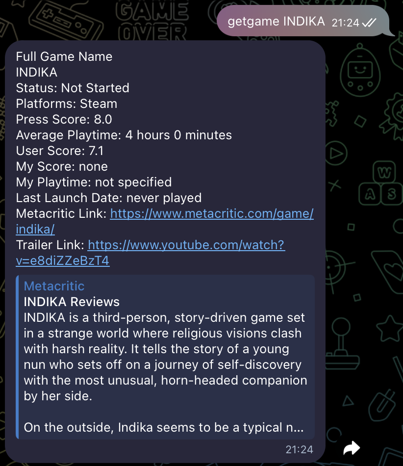
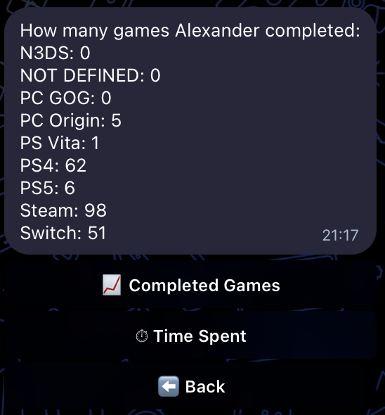
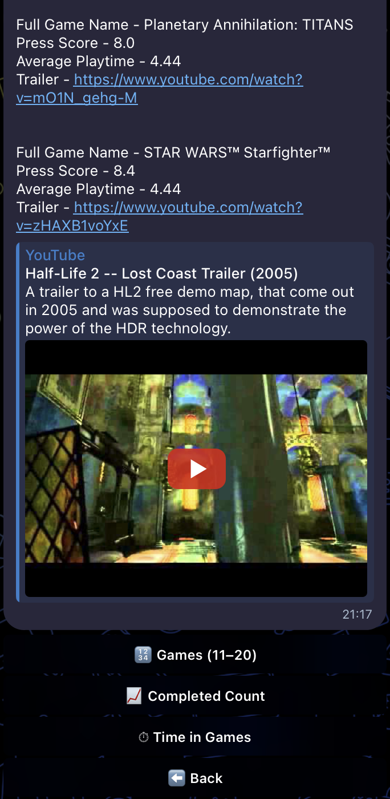
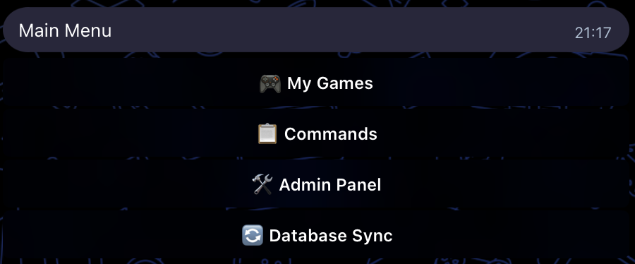

## game-db

[](https://github.com/alexander-kan/game_db/actions/workflows/ci.yml)
[](https://codecov.io/gh/alexander-kan/game_db)
[](https://www.python.org/downloads/)
[](https://opensource.org/licenses/MIT)
[](https://python-poetry.org/)

A Telegram bot and a set of utilities for managing a personal video games database:

- **SQLite database** `games.db` populated from an Excel file (`backup_db/games.xlsx`);
- **Telegram bot** that lets you:
  - search games by name;
  - view game lists by platform;
  - get statistics about completed games and play time;
  - manage service files on the server;
- **Steam Web API integration** to synchronize playtime statistics;
- **Metacritic parser** to extract genres and write them back to Excel;
- **Metacritic synchronization** to update game data (release date, scores, URL) from Metacritic.

### Quick Start

```bash
# 1. Clone and install
git clone https://github.com/alexander-kan/game_db.git
cd game_db
poetry install

# 2. Configure (copy examples and fill with your data)
cp settings/t_token.example.ini settings/t_token.ini
cp settings/users.example.ini settings/users.ini
cp backup_db/games.example.xlsx backup_db/games.xlsx

# 3. Initialize database
poetry run game-db-init

# 4. Run the bot
poetry run game-db-bot
```

### Screenshots

#### Game Search
<!-- TODO: Add screenshot of game search functionality -->

*Search for games by name and view detailed information*

#### Statistics
<!-- TODO: Add screenshot of statistics view -->

*View statistics about completed games and play time*

#### Game Lists
<!-- TODO: Add screenshot of game lists by platform -->

*Browse games by platform with pagination*

#### Main Menu
<!-- TODO: Add screenshot of main menu -->

*Interactive keyboard menu for easy navigation*

**Example bot interaction:**

```
User: getgame The Witcher 3
Bot: 🎮 The Witcher 3
     Status: Пройдена
     Platform: Steam
     Press Score: 9.2
     My Time: 120.5 часов
     Last Launch: January 15, 2024

User: Сколько игр прошёл Александр
Bot: Статистика по пройденным играм:
     Steam: 45 игр
     Switch: 12 игр
     PS4: 8 игр
     ...

User: Списки игр
Bot: [Shows menu with platform options]
```

### Requirements

- Python 3.10+
- Poetry (`pip install poetry`)

### Installation

```bash
git clone https://github.com/alexander-kan/game_db.git
cd game_db
poetry install
```

Then:

- copy example configs to real files and fill them with your data:
  - `settings/t_token.example.ini` → `settings/t_token.ini` (Telegram bot token, Steam API key and `steamid`);
  - `settings/users.example.ini` → `settings/users.ini` (list of users and admins);
- copy the example games file:
  - `backup_db/games.example.xlsx` → `backup_db/games.xlsx`, then adjust the structure/values to your needs.

### Architecture

```
┌─────────────────────────────────────────────────────────────┐
│                    Telegram Bot Layer                       │
│  ┌──────────┐  ┌─────────-─┐  ┌──────────┐  ┌──────────┐    │
│  │  bot.py  │→ │handlers.py│→ │ menu.py  │  │ texts.py │    │
│  └──────────┘  └──────────-┘  └──────────┘  └──────────┘    │
└─────────────────────────────────────────────────────────────┘
                            ↓
┌─────────────────────────────────────────────────────────────┐
│                    Service Layer                            │
│  ┌──────────────────┐  ┌──────────────────────┐             │
│  │  game_service.py │  │ message_formatter.py │             │
│  └──────────────────┘  └──────────────────────┘             │
│  ┌──────────────────────────────────────────┐               │
│  │    database_service.py (DatabaseService)  │               │
│  │  - recreate_db()                         │               │
│  │  - add_games()                           │               │
│  │  - synchronize_steam_games()             │               │
│  └──────────────────────────────────────────┘               │
└─────────────────────────────────────────────────────────────┘
                            ↓
┌─────────────────────────────────────────────────────────────┐
│                  Repository Layer                           │
│  ┌──────────────────┐                                       │
│  │game_repository.py│ (SQL queries from sql_querry/queries/)│
│  └──────────────────┘                                       │
└─────────────────────────────────────────────────────────────┘
                            ↓
┌─────────────────────────────────────────────────────────────┐
│                    Data Layer                               │
│  ┌──────────┐  ┌─────────---─┐  ┌──────────┐                │
│  │  db.py   │  │ExcelImporter│  │SteamSync │                │
│  │(Facade)  │  │(db_excel)   │  │          │                │
│  └──────────┘  └──────────---┘  └──────────┘                │
│  ┌────────-──┐  ┌─-─────────┐  ┌─────────────┐             │
│  │DictBuilder│  │SteamAPI   │  │SteamExcel   │             │
│  │(db_dict)  │  │(steam_api)│  │Formatter    │             │
│  └──────────-┘  └──-────────┘  └─────────────┘             │
└─────────────────────────────────────────────────────────────┘
                            ↓
┌─────────────────────────────────────────────────────────────┐
│                    Storage                                  │
│  SQLite (games.db)  │  Excel (backup_db/games.xlsx)         │
└─────────────────────────────────────────────────────────────┘
```

**Component overview:**

- `game_db/` — core Python package:
  - `bot.py` — Telegram bot entrypoint (initialization, handlers registration, polling);
  - `handlers.py` — message handlers and high-level bot logic (uses Command Pattern);
  - `menu.py` — reply keyboards and bot menus;
  - `commands/` — command pattern implementation for bot commands;
  - `services/` — service layer:
    - `game_service.py` — game-related queries and statistics (thin layer over repository);
    - `message_formatter.py` — formatting domain data into user-friendly messages;
    - `database_service.py` — high-level database operations (recreate, add games, Steam sync, Metacritic sync);
  - `repositories/` — data access layer:
    - `game_repository.py` — database queries (loads SQL from `sql_querry/queries/`);
  - `db.py` — low-level database operations and facade (`ChangeDB`, `DatabaseManager`, `SteamSynchronizer`, `MetacriticSynchronizer`);
  - `db_excel.py` — Excel import/export logic (`ExcelImporter`);
  - `db_dictionaries.py` — dictionary builders for status/platform (`DictionariesBuilder`);
  - `excel/` — Excel processing modules:
    - `reader.py`, `writer.py`, `validator.py` — Excel I/O and validation;
    - `steam_formatter.py` — formatting Steam data for Excel;
    - `metacritic_formatter.py` — formatting Metacritic data for Excel;
    - `models.py` — Excel data models;
  - `steam_api.py` — Steam Web API wrapper;
  - `MetaCriticScraper.py` — Metacritic page scraper for extracting game data;
  - `metacritic_search.py` — Metacritic search functionality for finding games by name;
  - `security.py` — user/admin checks;
  - `logging_config.py` — centralized logging setup;
  - `genres.py` — Metacritic genres parser (CLI utility);
  - `texts.py` — user-facing text constants;
  - `config.py` — paths and configuration loaders (typed configs: `SettingsConfig`, `TokensConfig`, `UsersConfig`);
  - `constants.py` — application-wide constants (Excel columns, sentinel values);
  - `utils.py` — small shared helpers;
  - `types.py` — data structures (`SteamGame`, `GameInfo`, etc.);
  - `exceptions.py` — custom exception hierarchy.
- `scripts/` — CLI entry points (use `DatabaseService`):
  - `scripts/init_db.py` — recreate `games.db` from `backup_db/games.xlsx`;
  - `scripts/sync_steam.py` — synchronize Steam data and update DB.
- Data/config directories (expected in project root):
  - `backup_db/` — Excel file(s) with games (`games.xlsx`, example: `games.example.xlsx`);
  - `settings/` — `.ini` configs (tokens, users, table/column names, paths; examples: `t_token.example.ini`, `users.example.ini`);
  - `sql_querry/` — `.sql` templates for DB schema and queries;
    - `create_db/` — schema creation scripts;
    - `queries/` — game repository SQL queries;
  - `files/`, `update_db/` — working directories used by the bot.

### Running

From Poetry:

```bash
poetry run game-db-bot
```

or

```bash
poetry run game-db-init
```

to recreate the database from Excel.

To synchronize Steam data and then update the DB:

```bash
poetry run game-db-sync-steam
```

### Metacritic Synchronization

The bot includes a **Metacritic synchronization** feature that updates game data from Metacritic:

- **Release date** — updates game release date
- **Press score** — updates critic score (converted from 0-100 to 0-10 scale)
- **User score** — updates user rating
- **Metacritic URL** — saves or updates the game's Metacritic page URL

**How it works:**

1. For games **with existing Metacritic URL**: uses the URL directly to fetch data
2. For games **without Metacritic URL**: searches Metacritic by game name and uses the first result
3. Updates Excel file with fetched data
4. Recreates database from updated Excel file

**Access:** Available through the bot's inline menu: "🎯 Синхронизация Metacritic" (admin only)

**Settings:**
- 10-second delay between requests to respect Metacritic's rate limits
- Test mode: limited to 20 games for testing (can be disabled for full sync)

### Access control and security

- The bot is **private by default**: only users listed in `settings/users.ini` can interact with it.
  - Section `[users]`:
    - `users` — space-separated list of allowed Telegram user IDs;
    - `admins` — space-separated list of admin user IDs (must be a subset of `users`).
- Admins have additional abilities (file management, DB updates, Steam sync); regular users can only query data.
- Secrets (Telegram bot token, Steam API key, SteamID) are stored in `settings/t_token.ini` and:
  - are **never logged**;
  - are not committed to Git (see `.gitignore`);
  - should be set only on your machine/server using the `*.example.ini` templates as a reference.

### Development

**Working cycle:**

1. **Install dependencies:**
   ```bash
   poetry install
   ```

2. **Run the bot:**
   ```bash
   poetry run game-db-bot
   ```

3. **Recreate database:**
   ```bash
   poetry run game-db-init
   ```

4. **Synchronize with Steam:**
   ```bash
   poetry run game-db-sync-steam
   ```

5. **Tests and quality checks:**
   ```bash
   poetry run pytest
   poetry run black game_db scripts tests
   poetry run isort game_db scripts tests
   poetry run flake8 game_db scripts tests
   poetry run mypy game_db
   ```

6. **Setup pre-commit hooks (optional but recommended):**
   ```bash
   poetry install  # Install pre-commit
   poetry run pre-commit install
   ```
   
   Pre-commit hooks will automatically run:
   - `black` - code formatting
   - `isort` - import sorting
   - `flake8` - linting
   - `mypy` - type checking
   - Various file checks (trailing whitespace, YAML/JSON validation, etc.)
   
   Before each commit, these checks will run automatically. To run manually:
   ```bash
   poetry run pre-commit run --all-files
   ```

**Generating requirements.txt (if needed for deployment):**

```bash
poetry export -f requirements.txt -o requirements.txt --without-hashes
```

> **Note**: The project uses Poetry for dependency management. The `poetry.lock` file is committed to ensure reproducible builds. For deployment on infrastructure that requires `requirements.txt`, generate it from Poetry as shown above.

### Roadmap

#### ✅ Completed
- [x] Dependency Injection implementation
- [x] Command Pattern for handlers
- [x] Comprehensive error handling
- [x] File safety utilities
- [x] Excel importer refactoring
- [x] Type safety improvements (mypy strict mode)
- [x] Comprehensive test coverage (80%+)
- [x] CI/CD pipeline setup
- [x] Documentation improvements

#### 🚧 In Progress
- [ ] Performance optimizations
- [ ] Additional platform support
- [ ] Enhanced statistics features

#### 📋 Planned
- [ ] **Improve Metacritic URL search** — enhance `metacritic_search.py` to better handle Metacritic's search page structure and find games by name when URL is not provided
- [ ] Web dashboard for game database management
- [ ] Multi-language support (i18n)
- [ ] Advanced filtering and search capabilities
- [ ] Export functionality (JSON, CSV)
- [ ] Integration with more gaming platforms (GOG, Epic Games)
- [ ] Achievement tracking
- [ ] Wishlist management
- [ ] Game recommendations based on play history
- [ ] Backup and restore functionality
- [ ] Docker containerization
- [ ] Kubernetes deployment manifests

#### 💡 Ideas
- [ ] Mobile app companion
- [ ] Social features (share game lists with friends)
- [ ] Game price tracking
- [ ] Release calendar
- [ ] Review aggregation from multiple sources

### Contributing

We welcome contributions! Please see [CONTRIBUTING.md](CONTRIBUTING.md) for guidelines.

### License

This project is licensed under the MIT License. See the `LICENSE` file for details.
