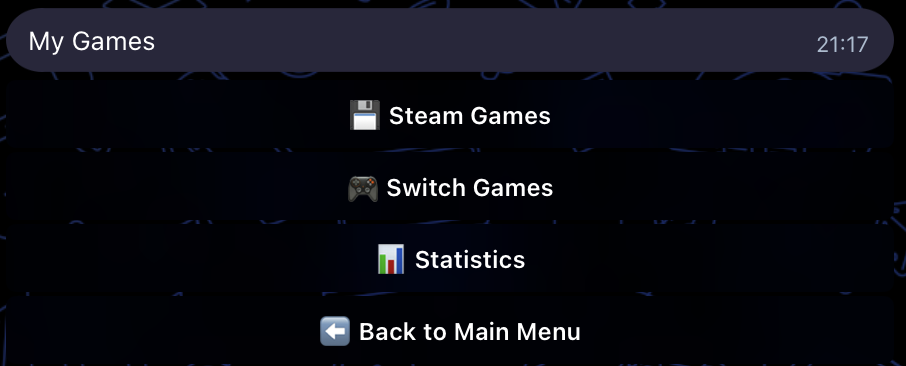
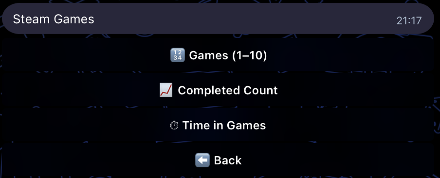
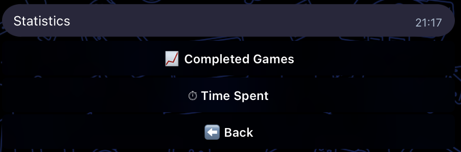
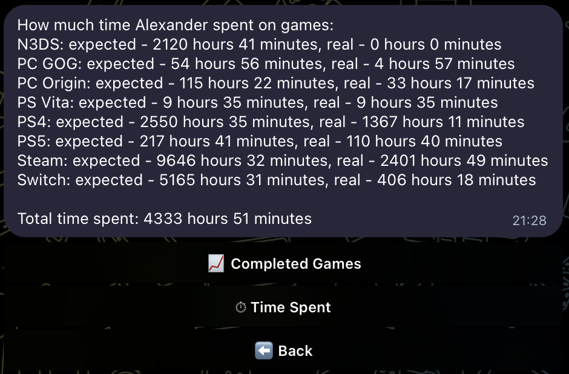
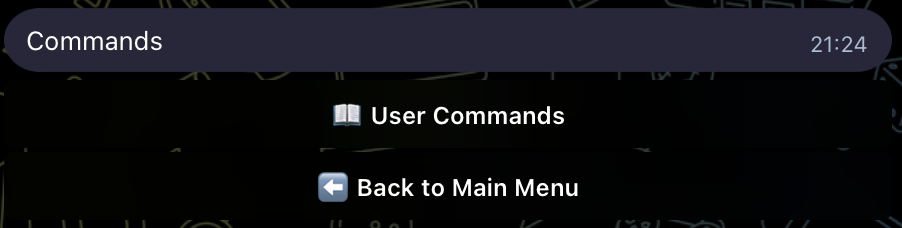
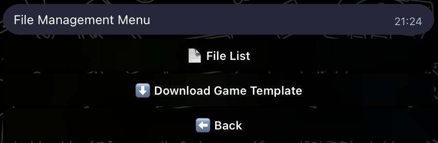
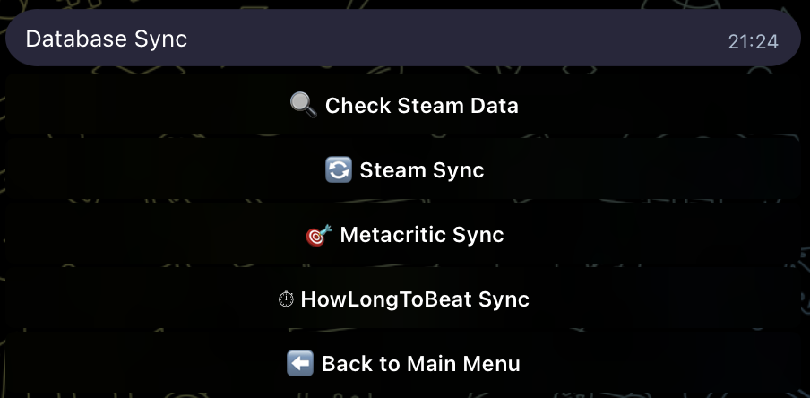
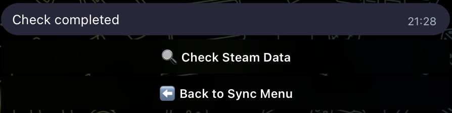
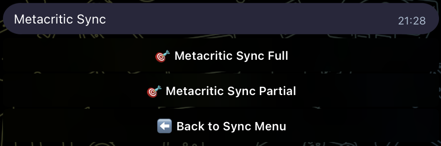
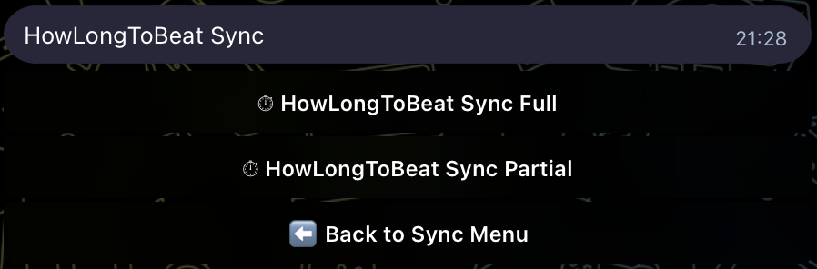

## game-db

[](https://github.com/alexander-kan/tele_game_db/actions/workflows/ci.yml)
[](https://codecov.io/gh/alexander-kan/tele_game_db)
[](https://www.python.org/downloads/)
[](https://opensource.org/licenses/MIT)
[](https://python-poetry.org/)

### About This Project

Initially, I needed to keep track of all my games across all platforms to avoid buying them multiple times (I kept forgetting which games I owned and where). I maintained this list in an Excel file, and then started using it for other purposes:

- **Choose the next game to play** from my library based on various criteria
- **Quickly record game completions**
- **View game statistics**
- **Most importantly**: I wanted to be able to add features myself and own my database. I didn't want to experience what happened with Notion - where suddenly all your records are blocked for no reason (see [this example](https://www.reddit.com/r/Notion/comments/1odxw00/notion_will_ban_your_account_for_no_reason_and/))

I also wanted to have this always at hand. I didn't want to write a full mobile app, so I created a Telegram bot instead.

Game lists are currently sorted by the game that requires the least amount of time to complete, in ascending order.

---

A Telegram bot and a set of utilities for managing a personal video games database:

- **SQLite database** `games.db` populated from an Excel file (`backup_db/games.xlsx`);
- **Telegram bot** that lets you:
  - search games by name;
  - view game lists by platform;
  - get statistics about completed games and play time;
  - manage service files on the server;
- **Steam Web API integration** to synchronize playtime statistics and add missing games;
- **Metacritic synchronization** to update game data (release date, scores, URL) from Metacritic;
- **HowLongToBeat synchronization** to update average completion times from HowLongToBeat.com.

### Quick Start

```bash
# 1. Clone and install
git clone https://github.com/alexander-kan/tele_game_db.git
cd tele_game_db
poetry install

# 2. Configure (copy examples and fill with your data)
cp settings/t_token.example.ini settings/t_token.ini
cp settings/users.example.ini settings/users.ini
cp backup_db/games.example.xlsx backup_db/games.xlsx

# 3. Initialize database
poetry run game-db-init

# 4. Run the bot
poetry run game-db-bot
```

### Screenshots

#### Main Menu

*Interactive inline keyboard menu for easy navigation*

#### My Games Submenu

*Access Steam Games, Switch Games, and Statistics*

#### Platform Menu (Steam/Switch)

*View games list, completed count, and time statistics for a platform*

#### Game Lists

*Browse games by platform with pagination*

#### Statistics Submenu

*View completed games and time spent statistics*

#### Statistics View


*View statistics about completed games and play time*

#### Game Search

*Search for games by name and view detailed information*

#### Commands Submenu

*Access user commands and help*

#### Admin Panel Submenu

*Access file management and admin commands (admin only)*

#### File Management Submenu

*Manage files and download game template (admin only)*

#### Database Sync Menu

*Access synchronization options for Steam, Metacritic, and HowLongToBeat*

#### Steam Check Menu

*Check Steam data and add missing games to database*

#### Metacritic Sync Submenu

*Choose between full or partial Metacritic synchronization*

#### HowLongToBeat Sync Submenu

*Choose between full or partial HowLongToBeat synchronization*

**Example bot interaction:**

```
User: getgame The Witcher 3
Bot: 🎮 The Witcher 3
     Status: Completed
     Platform: Steam
     Press Score: 9.2
     My Time: 120 hours 30 minutes
     Last Launch: January 15, 2024

User: How many games Alexander completed
Bot: Completed games statistics:
     Steam: 45 games
     Switch: 12 games
     PS4: 8 games
     ...

User: Game Lists
Bot: [Shows menu with platform options]
```

### Requirements

- Python 3.10+
- Poetry (`pip install poetry`)

### Installation

```bash
git clone https://github.com/alexander-kan/tele_game_db.git
cd tele_game_db
poetry install
```

Then:

- copy example configs to real files and fill them with your data:
  - `settings/t_token.example.ini` → `settings/t_token.ini` (Telegram bot token, Steam API key and `steamid`);
  - `settings/users.example.ini` → `settings/users.ini` (list of users and admins);
- configure owner name in `settings/settings.ini`:
  - Add `[OWNER]` section with `owner_name = YourName` (defaults to "Alexander" if not set);
  - This name will be used in bot messages (e.g., "How many games YourName completed");
- copy the example games file:
  - `backup_db/games.example.xlsx` → `backup_db/games.xlsx`, then adjust the structure/values to your needs.

### Architecture

```
┌─────────────────────────────────────────────────────────────┐
│                    Telegram Bot Layer                       │
│  ┌──────────┐  ┌──────────────┐  ┌────────────────────┐     │
│  │  bot.py  │→ │ handlers.py  │→ │callback_handlers.py│     │
│  └──────────┘  └──────────────┘  └────────────────────┘     │
│  ┌──────────┐  ┌───────────┐  ┌──────────────┐              │
│  │ menu.py  │  │inline_menu│  │menu_callbacks│              │
│  │(reply)   │  │(inline)   │  │              │              │
│  └──────────┘  └───────────┘  └──────────────┘              │
│  ┌──────────┐  ┌──────────┐                                 │
│  │ texts.py │  │commands/ │ (Command Pattern)               │
│  └──────────┘  └──────────┘                                 │
└─────────────────────────────────────────────────────────────┘
                            ↓
┌─────────────────────────────────────────────────────────────┐
│                    Service Layer                            │
│  ┌──────────────────┐  ┌──────────────────────┐             │
│  │  game_service.py │  │ message_formatter.py │             │
│  └──────────────────┘  └──────────────────────┘             │
│  ┌──────────────────────────────────────────┐               │
│  │    database_service.py (DatabaseService) │               │
│  │  - recreate_db()                         │               │
│  │  - add_games()                           │               │
│  │  - synchronize_steam_games()             │               │
│  │  - synchronize_metacritic_games()        │               │
│  │  - synchronize_hltb_games()              │               │
│  └──────────────────────────────────────────┘               │
└─────────────────────────────────────────────────────────────┘
                            ↓
┌─────────────────────────────────────────────────────────────┐
│                  Repository Layer                           │
│  ┌──────────────────┐                                       │
│  │game_repository.py│ (SQL queries from sql_querry/queries/)│
│  └──────────────────┘                                       │
└─────────────────────────────────────────────────────────────┘
                            ↓
┌─────────────────────────────────────────────────────────────┐
│                    Data Layer                               │
│  ┌──────────┐  ┌─────────---─┐                              │
│  │  db.py   │  │ExcelImporter│                              │
│  │(Facade)  │  │(db_excel)   │                              │
│  └──────────┘  └──────────---┘                              │
│  ┌────────-──┐  ┌─────────────────────────────────────┐     │
│  │DictBuilder│  │ Synchronizers:                      │     │
│  │(db_dict)  │  │ - SteamSynchronizer                 │     │
│  └──────────-┘  │ - MetacriticSynchronizer            │     │
│                 │ - HowLongToBeatSynchronizer         │     │
│  ┌──────────────┴─────────────────────────────────────┐     │
│  │ External API Clients:                              │     │
│  │ - SteamAPI (steam_api.py)                          │     │
│  │ - MetaCriticScraper                                │     │
│  │ - metacritic_search                                │     │
│  │ - HowLongToBeatClient (hltb_client.py)             │     │
│  │ - similarity_search (Damerau-Levenshtein)          │     │
│  └────────────────────────────────────────────────────┘     │
│  ┌─────────────────────────────────────────────────────┐    │
│  │ Excel Formatters:                                   │    │
│  │ - SteamExcelFormatter                               │    │
│  │ - MetacriticExcelFormatter                          │    │
│  │ - HowLongToBeatExcelFormatter                       │    │
│  └─────────────────────────────────────────────────────┘    │
└─────────────────────────────────────────────────────────────┘
                            ↓
┌─────────────────────────────────────────────────────────────┐
│                    Storage                                  │
│  SQLite (games.db)  │  Excel (backup_db/games.xlsx)         │
└─────────────────────────────────────────────────────────────┘
```

**Component overview:**

- `game_db/` — core Python package:
  - **Bot Layer:**
    - `bot.py` — Telegram bot entrypoint (initialization, handlers registration, polling);
    - `handlers.py` — message handlers and high-level bot logic (uses Command Pattern);
    - `callback_handlers.py` — inline keyboard callback query handlers;
    - `menu.py` — reply keyboards and bot menus;
    - `inline_menu.py` — inline keyboard menu builders;
    - `menu_callbacks.py` — callback action definitions and parsing;
    - `commands/` — command pattern implementation for bot commands;
    - `texts.py` — user-facing text constants;
  - **Service Layer:**
    - `services/game_service.py` — game-related queries and statistics (thin layer over repository);
    - `services/message_formatter.py` — formatting domain data into user-friendly messages;
    - `services/database_service.py` — high-level database operations (recreate, add games, Steam/Metacritic/HLTB sync);
  - **Repository Layer:**
    - `repositories/game_repository.py` — database queries (loads SQL from `sql_querry/queries/`);
  - **Data Layer:**
    - `db.py` — low-level database operations and facade (`ChangeDB`, `DatabaseManager`, `SteamSynchronizer`, `MetacriticSynchronizer`, `HowLongToBeatSynchronizer`);
    - `db_excel.py` — Excel import/export logic (`ExcelImporter`);
    - `db_dictionaries.py` — dictionary builders for status/platform (`DictionariesBuilder`);
    - `excel/` — Excel processing modules:
      - `reader.py`, `writer.py`, `validator.py` — Excel I/O and validation;
      - `steam_formatter.py` — formatting Steam data for Excel;
      - `metacritic_formatter.py` — formatting Metacritic data for Excel;
      - `hltb_formatter.py` — formatting HowLongToBeat data for Excel;
      - `models.py` — Excel data models (`GameRow`);
    - **External API Clients:**
      - `steam_api.py` — Steam Web API wrapper;
      - `MetaCriticScraper.py` — Metacritic page scraper for extracting game data;
      - `metacritic_search.py` — Metacritic search functionality for finding games by name;
      - `hltb_client.py` — HowLongToBeat.com API client wrapper;
      - `similarity_search.py` — Damerau-Levenshtein distance algorithm for finding similar game names;
  - **Utilities:**
    - `security.py` — user/admin checks;
    - `logging_config.py` — centralized logging setup;
    - `config.py` — paths and configuration loaders (typed configs: `SettingsConfig`, `TokensConfig`, `UsersConfig`);
    - `constants.py` — application-wide constants (Excel columns, sentinel values);
    - `utils.py` — small shared helpers;
    - `types.py` — data structures (`SteamGame`, `GameInfo`, etc.);
    - `exceptions.py` — custom exception hierarchy.
- `scripts/` — CLI entry points (use `DatabaseService`):
  - `scripts/init_db.py` — recreate `games.db` from `backup_db/games.xlsx`;
  - `scripts/sync_steam.py` — synchronize Steam data and update DB.
- Data/config directories (expected in project root):
  - `backup_db/` — Excel file(s) with games (`games.xlsx`, example: `games.example.xlsx`);
  - `settings/` — `.ini` configs (tokens, users, table/column names, paths; examples: `t_token.example.ini`, `users.example.ini`);
  - `sql_querry/` — `.sql` templates for DB schema and queries;
    - `create_db/` — schema creation scripts;
    - `queries/` — game repository SQL queries;
  - `files/`, `update_db/` — working directories used by the bot.

### Running

From Poetry:

```bash
poetry run game-db-bot
```

or

```bash
poetry run game-db-init
```

to recreate the database from Excel.

To synchronize Steam data and then update the DB:

```bash
poetry run game-db-sync-steam
```

### Database Synchronization

The bot includes three synchronization features to keep your game database up-to-date with external sources. All synchronizations update both the Excel file and the database (by recreating it from the updated Excel).

#### Steam Synchronization

**Features:**

1. **Check Steam Data**
   - Compares your Steam library with the database
   - Shows games from Steam that are missing in your database
   - Uses Damerau-Levenshtein distance algorithm to find similar games in your database
   - Displays similarity matches for each missing game

2. **Add Found Games to DB**
   - Appears after checking Steam data (if missing games are found)
   - Adds missing Steam games to Excel and database
   - Automatically sets:
     - Platform: "Steam"
     - Status: "Not Started" (or "Dropped" if game was launched)
     - Game name from Steam
     - Playtime and last launch date (if game was launched)
     - Other fields to default values

3. **Steam Sync** (Full Steam Sync)
   - Updates existing games in the database with Steam data
   - Updates fields:
     - **My Playtime (Steam)** — playtime from Steam API (converted to hours)
     - **Last Launch (Steam)** — last launch date from Steam API
     - **Status** — sets to "Dropped" if game was launched
   - Finds and logs games in database with Steam platform that are not in Steam API response
   - Uses similarity matching to find potential matches

**How it works:**

1. Fetches all games from Steam Web API
2. Matches Steam games with Excel rows by exact name
3. Updates matched games with Steam playtime and dates
4. Finds similar games for missing ones using Damerau-Levenshtein distance
5. Updates Excel file
6. Recreates database from updated Excel file

**Access:** Available through the bot's inline menu: "🔄 Database Sync" → "🔄 Steam Sync" (admin only)

**Settings:**
- Requires Steam API key and SteamID in `settings/t_token.ini`
- Similarity thresholds are configurable in `settings/similarity_thresholds.ini`

#### Metacritic Synchronization

**Features:**

- **Full Sync**
  - Updates all games in the database
  - Updates fields:
    - **Release Date** — game release date
    - **Press Score** — critic score (converted from 0-100 to 0-10 scale)
    - **User Score** — user rating
    - **Metacritic URL** — saves or updates the game's Metacritic page URL

- **Partial Sync**
  - Only processes games with empty "Press Score" and "User Score" fields
  - Skips games that already have scores
  - Returns "No data to sync" if no games need updating

**How it works:**

1. For games **with existing Metacritic URL**: uses the URL directly to fetch data
2. For games **without Metacritic URL**: searches Metacritic by game name and uses the first result
3. Updates Excel file with fetched data
4. Recreates database from updated Excel file

**Access:** Available through the bot's inline menu: "🔄 Database Sync" → "🎯 Metacritic Sync" (admin only)

**Settings:**
- 10-second delay between requests to respect Metacritic's rate limits
- Test mode: limited to 20 games for testing (can be disabled for full sync)

#### HowLongToBeat Synchronization

**Features:**

- **Full Sync**
  - Updates all games in the database
  - Updates fields:
    - **Average Time Beat** — average completion time from HowLongToBeat.com
  - If game is not found:
    - Writes "0" if the field is currently empty
    - Preserves existing value if the field already has data

- **Partial Sync**
  - Only processes games with empty "Average Time Beat" field
  - Skips games that already have completion time
  - Writes "0" if game is not found on HowLongToBeat
  - Returns "No data to sync" if no games need updating

**How it works:**

1. Searches for each game on HowLongToBeat.com by game name
2. Extracts completion time data (prioritizes `main_story`, falls back to `completionist` if needed)
3. Updates Excel file with fetched data
4. Recreates database from updated Excel file

**Access:** Available through the bot's inline menu: "🔄 Database Sync" → "⏱ HowLongToBeat Sync" (admin only)

**Settings:**
- 10-second delay between requests to respect HowLongToBeat's rate limits
- Test mode: limited to 20 games for testing (can be disabled for full sync)
- Uses `howlongtobeatpy` library for API access

#### Synchronization Workflow

All synchronizations follow the same pattern:

1. **Read data** from external source (Steam API, Metacritic, HowLongToBeat)
2. **Update Excel file** with fetched data
3. **Generate SQL files** (`dml_games.sql`, `dml_games_on_platforms.sql`) from updated Excel
4. **Recreate database** by:
   - Dropping existing tables
   - Creating new tables
   - Populating dictionaries
   - Importing games from generated SQL files

This ensures that:
- Excel file is always the source of truth
- Database always matches the current Excel state
- All games from Excel (including newly added ones) are included in the database

### Configuration

#### Owner Name

The bot uses the owner's name in various messages (e.g., "How many games Alexander completed"). Configure it in `settings/settings.ini`:

```ini
[OWNER]
owner_name = Alexander
```

- **Default value**: "Alexander" (if `[OWNER]` section is missing)
- **Usage**: The name appears in:
  - Statistics messages ("How many games {owner_name} completed")
  - Time statistics ("How much time {owner_name} spent on games")
  - Menu buttons with owner-specific commands

### Access control and security

- The bot is **private by default**: only users listed in `settings/users.ini` can interact with it.
  - Section `[users]`:
    - `users` — space-separated list of allowed Telegram user IDs;
    - `admins` — space-separated list of admin user IDs (must be a subset of `users`).
- Admins have additional abilities (file management, DB updates, Steam sync); regular users can only query data.
- Secrets (Telegram bot token, Steam API key, SteamID) are stored in `settings/t_token.ini` and:
  - are **never logged**;
  - are not committed to Git (see `.gitignore`);
  - should be set only on your machine/server using the `*.example.ini` templates as a reference.

### Development

**Working cycle:**

1. **Install dependencies:**
   ```bash
   poetry install
   ```

2. **Run the bot:**
   ```bash
   poetry run game-db-bot
   ```

3. **Recreate database:**
   ```bash
   poetry run game-db-init
   ```

4. **Synchronize with Steam:**
   ```bash
   poetry run game-db-sync-steam
   ```

5. **Tests and quality checks:**
   ```bash
   poetry run pytest
   poetry run black game_db scripts tests
   poetry run isort game_db scripts tests
   poetry run flake8 game_db scripts tests
   poetry run mypy game_db
   ```

6. **Setup pre-commit hooks (optional but recommended):**
   ```bash
   poetry install  # Install pre-commit
   poetry run pre-commit install
   ```
   
   Pre-commit hooks will automatically run:
   - `black` - code formatting
   - `isort` - import sorting
   - `flake8` - linting
   - `mypy` - type checking
   - Various file checks (trailing whitespace, YAML/JSON validation, etc.)
   
   Before each commit, these checks will run automatically. To run manually:
   ```bash
   poetry run pre-commit run --all-files
   ```

**Generating requirements.txt (if needed for deployment):**

```bash
poetry export -f requirements.txt -o requirements.txt --without-hashes
```

> **Note**: The project uses Poetry for dependency management. The `poetry.lock` file is committed to ensure reproducible builds. For deployment on infrastructure that requires `requirements.txt`, generate it from Poetry as shown above.

### Roadmap

#### ✅ Completed
- [x] Dependency Injection implementation
- [x] Command Pattern for handlers
- [x] Comprehensive error handling
- [x] File safety utilities
- [x] Excel importer refactoring
- [x] Type safety improvements (mypy strict mode)
- [x] Comprehensive test coverage (80%+)
- [x] CI/CD pipeline setup
- [x] Documentation improvements

#### 🚧 In Progress
- [ ] Performance optimizations
- [ ] Additional platform support
- [ ] Enhanced statistics features

#### 📋 Planned
- [ ] **Improve Metacritic URL search** — enhance `metacritic_search.py` to better handle Metacritic's search page structure and find games by name when URL is not provided
- [ ] Web dashboard for game database management
- [ ] Multi-language support (i18n)
- [ ] Advanced filtering and search capabilities
- [ ] Export functionality (JSON, CSV)
- [ ] Integration with more gaming platforms (GOG, Epic Games)
- [ ] Achievement tracking
- [ ] Wishlist management
- [ ] Game recommendations based on play history
- [ ] Backup and restore functionality
- [ ] Docker containerization
- [ ] Kubernetes deployment manifests

#### 💡 Ideas
- [ ] Mobile app companion
- [ ] Social features (share game lists with friends)
- [ ] Game price tracking
- [ ] Release calendar
- [ ] Review aggregation from multiple sources

### Contributing

I welcome contributions! Please see [CONTRIBUTING.md](CONTRIBUTING.md) for guidelines.

### License

This project is licensed under the MIT License. See the `LICENSE` file for details.
